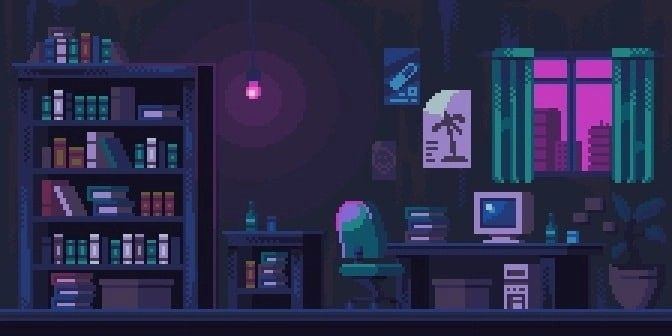

  

  <h1>Olá 👋, eu sou o Isaac</h1>
  
Desenvolvedor Fullstack  
    
  

  
Estudando e criando soluções inovadoras para a web.

---

### 👨‍💻 Sobre Mim

-  🔭 Atualmente trabalho em projetos **Pessoais**
-  🎓 Estudando **Análise e Desenvolvimento de Sistemas** para me tornar um desenvolvedor Full Stack
-  💬 Pergunte-me sobre **NodeJs**, **Express** e **MongoDB**
-  🌱 Atualmente aprendendo **Flutter** e **Dart** para desenvolvimento mobile
-  🎯 Meu objetivo é contribuir para projetos inovadores e impactar positivamente o mundo através da tecnologia
-  🎸 Gosto de tocar guitarra nas horas vagas
-  ⚡ Curiosidade: Sou apaixonado por resolver problemas complexos e aprender novas tecnologias

---

### 🛠️ Tech Stack

  
  
  
  
  
  
  
  
  
  
  

---

### 📊 Estatísticas GitHub

  
  

  

---

  <picture>
    <source media="(prefers-color-scheme: dark)" srcset="https://raw.githubusercontent.com/isaacggr/isaacggr/output/github-snake-dark.svg" />
    <source media="(prefers-color-scheme: light)" srcset="https://raw.githubusercontent.com/isaacggr/isaacggr/output/github-snake.svg" />
    
  </picture>

---

**Obrigado por visualizar meu perfil! Caso tenha dúvidas ou sugestões, entre em contato.**
